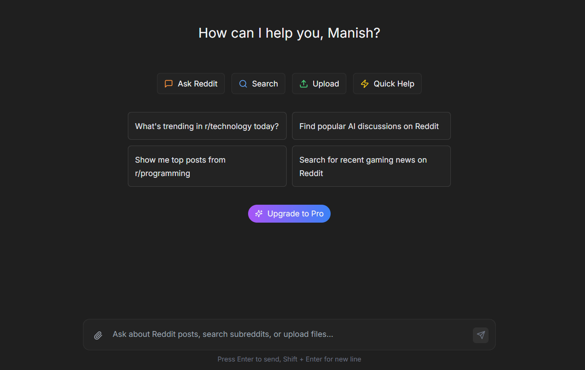

# 🤖 ReddiChat - AI Chat with Reddit Integration



> **[Try ReddiChat Live](https://reddichat-frontend-267146955755.us-east1.run.app/)** 🚀

ReddiChat is an intelligent chatbot that combines the power of AI with real-time Reddit insights. Get answers enriched with current discussions, opinions, and trends from Reddit communities.

## ✨ Features

### 🎯 **AI-Powered Conversations**

- Chat with advanced AI (Gemini 2.5 Flash) for intelligent responses
- Context-aware conversations with memory across sessions
- Natural language understanding for complex queries

### 🔍 **Reddit Integration**

- **Real-time Reddit Search**: Get current discussions and opinions from Reddit
- **Source Attribution**: See exactly which Reddit posts inform the AI's responses
- **Community Insights**: Access diverse perspectives from various subreddits
- **Smart Tool Selection**: AI automatically decides when to search Reddit for relevant information

### 💬 **Rich Chat Experience**

- **Persistent Chat History**: All your conversations are saved and searchable
- **Modern Interface**: Clean, responsive design inspired by leading chat platforms
- **Source Display**: Interactive cards showing Reddit posts with links, scores, and metadata
- **Mobile-Friendly**: Works seamlessly on desktop and mobile devices

### 🔐 **Secure Authentication**

- Google OAuth integration for secure login
- Session management with proper security
- User-specific chat history and settings

## 🚀 Quick Start

### 1. **Access ReddiChat**

Visit **[https://reddichat-frontend-267146955755.us-east1.run.app/](https://reddichat-frontend-267146955755.us-east1.run.app/)** in your browser.

### 2. **Sign In**

Click **"Sign in with Google"** to authenticate and start chatting.

### 3. **Start Chatting**

Ask questions like:

- *"What are people saying about the new iPhone on Reddit?"*
- *"Reddit discussions about machine learning trends"*
- *"What do developers think about Python vs JavaScript?"*

## 🎯 How It Works

### Intelligent Tool Selection

ReddiChat's AI automatically determines when to search Reddit based on your questions:

```
You: "What's the latest buzz about AI on Reddit?"
🤖 AI: *Automatically searches Reddit for recent AI discussions*
📱 Shows Reddit posts with sources, scores, and links
```

### Rich Source Attribution

Every Reddit-sourced response includes:

- **Post Title & Content**: Direct excerpts from Reddit posts
- **Community Context**: Which subreddit the discussion is from
- **Engagement Metrics**: Upvotes and comment counts
- **Direct Links**: Click to view the full Reddit thread
- **Author Information**: See who posted the content

### Persistent Memory

- **Chat History**: Access all your previous conversations
- **Context Retention**: AI remembers context within conversations
- **Cross-Session Memory**: Pick up where you left off

## 🛠️ Technology Stack

### Frontend

- **React** with modern hooks and state management
- **Tailwind CSS** for responsive, beautiful UI
- **Zustand** for efficient state management
- **Vite** for fast development and building

### Backend

- **FastAPI** for high-performance API endpoints
- **LangGraph** for intelligent agent orchestration
- **SQLAlchemy** with SQLite for data persistence
- **Google Gemini** for advanced AI capabilities
- **PRAW** (Python Reddit API Wrapper) for Reddit integration

### Infrastructure

- **Google Cloud Run** for scalable deployment
- **Docker** containerization for consistency
- **OAuth 2.0** for secure authentication

## 📱 Use Cases

### 🎓 **Research & Learning**

- Get current opinions on academic topics
- Find community discussions about learning resources
- Discover trending technologies and tools

### 💼 **Market Research**

- Understand public sentiment about products/services
- Track discussions about industry trends
- Gather user feedback and opinions

### 🎮 **Entertainment & Hobbies**

- Find community reactions to movies, games, books
- Discover new hobbies through Reddit communities
- Get recommendations from enthusiast communities

### 📊 **Decision Making**

- Gather diverse perspectives before making decisions
- See real user experiences with products/services
- Access community wisdom on various topics

## 🔒 Privacy & Security

- **Secure Authentication**: Google OAuth 2.0 implementation
- **Data Protection**: User conversations are private and secure
- **No Reddit Account Required**: Access Reddit insights without needing a Reddit account
- **Transparent Sources**: All Reddit sources are clearly attributed and linked

## 🚀 Getting Started for Developers

### Prerequisites

- **Python 3.13+** for backend
- **Node.js 18+** for frontend
- **Docker** (optional, for containerized deployment)

### Local Development

1. **Clone the repository**

   ```bash
   git clone <repository-url>
   cd ReddiChat
   ```

2. **Set up Environment Variables**

   ```bash
   cd backend
   cp env.example .env
   ```

   **Required**: Edit `.env` and add your Google Gemini API key:

   ```env
   GEMINI_API_KEY=your_actual_api_key_here
   ```

   > 🔑 **Get your free Gemini API key**: [Google AI Studio](https://makersuite.google.com/app/apikey)

3. **Backend Setup**

   ```bash
   cd backend
   pip install uv  # Modern Python package manager
   uv install
   uv run uvicorn app.main:app --reload
   ```

4. **Frontend Setup**

   ```bash
   cd frontend
   npm install
   npm run dev
   ```

5. **Optional Configuration**
   - Set up Google OAuth credentials for authentication
   - Configure Reddit API access for enhanced search capabilities

### Docker Deployment

```bash
docker compose up --build
```

## 📚 API Documentation

When running locally, access interactive API documentation at:

- **Swagger UI**: `http://localhost:8000/docs`
- **ReDoc**: `http://localhost:8000/redoc`

## 🤝 Contributing

We welcome contributions! Areas where you can help:

- **New AI Tools**: Integrate additional data sources
- **UI/UX Improvements**: Enhance the chat interface
- **Performance Optimization**: Improve response times
- **Feature Requests**: Suggest new capabilities

## 📄 License

This project is licensed under the MIT License - see the [LICENSE](LICENSE) file for details.

## 🌟 Star This Project

If you find ReddiChat useful, please ⭐ star this repository to show your support!

---

**Built with ❤️ for the Reddit and AI communities**

🔗 **[Start Chatting Now](https://reddichat-frontend-267146955755.us-east1.run.app/)**
