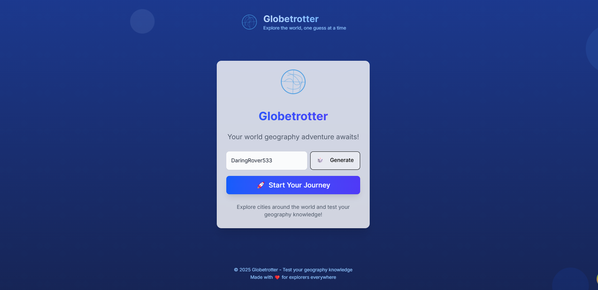
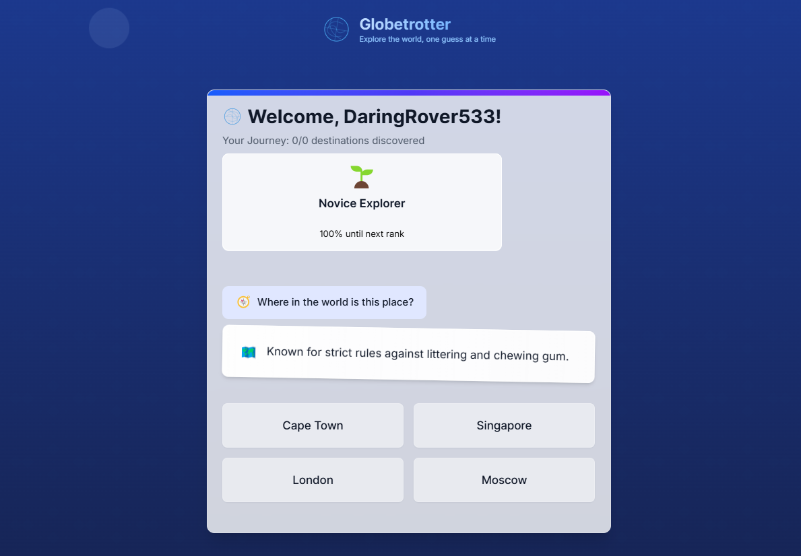
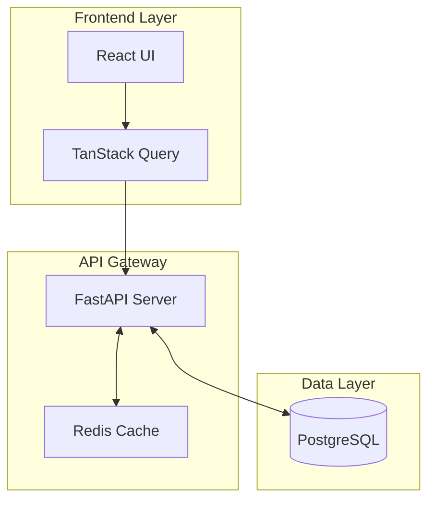
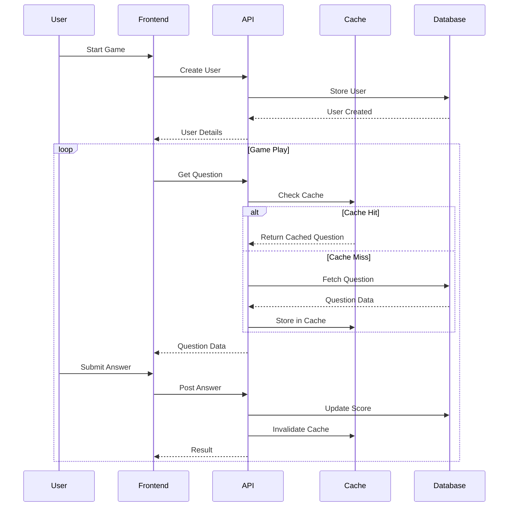

# 🌍 Globetrotter

A real-time geography quiz game that tests your knowledge of world cities through an engaging and interactive experience.

## 🎮 Game Preview


*Home screen where players can start their journey*


*Beginning of a new game session*


*Feedback when player makes a correct guess*

## 🏗️ Architecture Overview

Globetrotter is built with a modern, scalable architecture using FastAPI for the backend, PostgreSQL for data persistence, and React with TanStack Query for the frontend.



### Data Flow



## 🚀 Features

- 🌐 Real-time geography quiz game
- 🎲 Random city selection from a vast database
- 📊 Score tracking and statistics
- 🏆 Achievement system
- 🔄 Instant feedback on answers
- 📱 Responsive design for all devices

## 🛠️ Tech Stack

### Frontend

- React with TypeScript
- Next.js 13+ (App Router)
- TanStack Query for data fetching
- Tailwind CSS for styling
- Shadcn UI components

### Backend

- FastAPI (Python)
- PostgreSQL for data persistence
- Redis for caching
- Pydantic for data validation
- SQLAlchemy ORM

## 🏃‍♂️ Running Locally

### Prerequisites

- Docker and Docker Compose
- Node.js 18+ (for local development)
- Python 3.11+ (for local development)

### Using Docker

1. Clone the repository

```bash
git clone https://github.com/yourusername/globetrotter.git
cd globetrotter
```

2. Create environment files

```bash
cp backend/.env.example backend/.env
```

3. Start the application

```bash
docker-compose up
```

The application will be available at:

- Frontend: <http://localhost:3000>
- Backend API: <http://localhost:8000>
- API Docs: <http://localhost:8000/docs>

### Local Development

1. Frontend Setup

```bash
cd frontend
npm install
npm run dev
```

2. Backend Setup

```bash
cd backend
python -m venv venv
source venv/bin/activate  # On Windows: venv\Scripts\activate
pip install -r requirements.txt
uvicorn src.main:app --reload
```

## 📝 API Documentation

### Core Endpoints

1. `POST /api/v1/users`
   - Create new user
   - Returns user details and session token

2. `GET /api/v1/game/question`
   - Fetch random question
   - Cached for 5 minutes

3. `POST /api/v1/game/answer`
   - Submit answer
   - Updates user score
   - Returns result with fun fact

4. `GET /api/v1/users/{username}/stats`
   - Fetch user statistics

For complete API documentation, visit `/docs` when running the backend server.

## 🤝 Contributing

Contributions are welcome! Please read our [Contributing Guidelines](CONTRIBUTING.md) for details on our code of conduct and the process for submitting pull requests.

## 📜 License

This project is licensed under the MIT License - see the [LICENSE](LICENSE) file for details.

## 🙏 Acknowledgments

- City data provided by [GeoNames](https://www.geonames.org/)
- Icons from [Heroicons](https://heroicons.com/)
- UI components from [shadcn/ui](https://ui.shadcn.com/)
