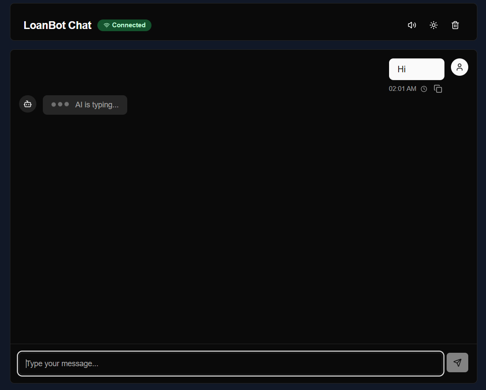
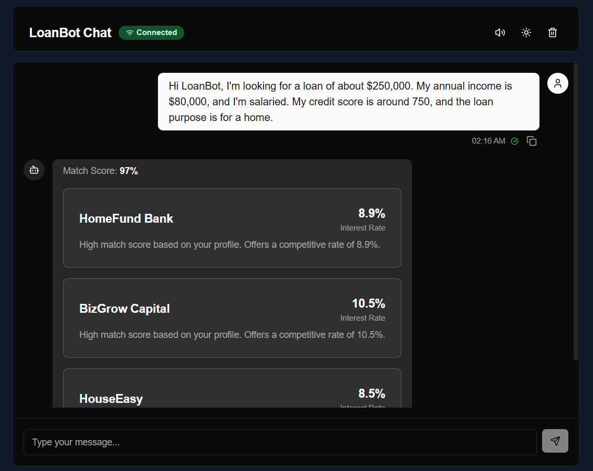

# Loan Advisor Chatbot Service

This project is a web application that provides a conversational UI for borrowers to find suitable lenders. Users can input their loan application details and receive a match score along with the top 3 lender recommendations, powered by a machine learning model.

## Screenshots

Here is a glimpse of the application's interface.




## Tech Stack

The project is built with a modern tech stack designed for performance and scalability:

* **Frontend**:
  * **Framework**: [Next.js](https://nextjs.org/) (React)
  * **Language**: [TypeScript](https://www.typescriptlang.org/)
  * **UI**: [Tailwind CSS](https://tailwindcss.com/) & [Shadcn UI](https://ui.shadcn.com/)
  * **State Management**: React Hooks for local state and SWR for data fetching.

* **Backend (ML Service)**:
  * **Framework**: [FastAPI](https://fastapi.tiangolo.com/)
  * **Language**: [Python](https://www.python.org/)
  * **ML Libraries**: Scikit-learn, Pandas

* **Containerization**:
  * [Docker](https://www.docker.com/) for containerizing both frontend and backend services for consistent development and deployment environments.

## Architecture & Data Flow

The application follows a client-server architecture where the frontend communicates with the backend ML service to provide real-time lender matching.

1. **User Interaction**: The user provides their loan requirements through a chat interface on the Next.js frontend.
2. **API Request**: The frontend sends the collected data to the FastAPI backend via a REST API call.
3. **ML Processing**: The backend's ML model (`loan_matcher.py`) processes the input and scores available lenders.
4. **Scoring Logic**: The model calculates a match score for each lender based on factors like loan amount, income, employment status, and credit score. It then ranks them to find the top 3 matches.
5. **API Response**: The backend returns a JSON object containing the overall match score and a list of the top 3 lenders with their details and the reasons for the match.
6. **Display Results**: The frontend parses the response and displays the score and lender cards back to the user in the chat UI.

## User Flow

1. **Introduction**: The chatbot greets the user with a welcoming message.
2. **Data Collection**: The chatbot sequentially asks for:
    * Desired loan amount
    * Annual income
    * Employment status
    * Credit score
    * Loan purpose
3. **Submission**: Once all data is collected, it is sent to the backend for analysis.
4. **Results**: The frontend displays:
    * A numeric match score (e.g., 85/100).
    * Cards for the top 3 lenders, showing their name, interest rate, and a brief explanation for the match.

## Lender Dataset

The ML model makes predictions against a dataset of 15 sample lenders, located in `ml/data/lenders.json`. This dataset is loaded in memory by the backend service at startup.

## ML Model

* **Inputs**: Loan amount, income, employment type, credit score, loan purpose.
* **Output**: A ranking of the 15 lenders.
* **Approach**: A pre-trained classification model (`loan_predictor_model.joblib`) is used to predict the best matches. The training data was synthetically generated based on a set of rules to create "good match" labels. The model provides scores for each lender, and the backend selects the top 3.

## Getting Started

Follow these instructions to set up and run the project locally.

### Prerequisites

* [Node.js](https://nodejs.org/) (v18+) and [pnpm](https://pnpm.io/)
* [Python](https://www.python.org/) (v3.9+) and [uv](https://github.com/astral-sh/uv) (or pip)
* [Docker](https://www.docker.com/) (Optional, for containerized setup)

### Frontend (`frontend/`)

1. **Navigate to the directory**:

    ```bash
    cd frontend
    ```

2. **Install dependencies**:

    ```bash
    pnpm install
    ```

3. **Run the development server**:

    ```bash
    pnpm dev
    ```

    The application will be available at `http://localhost:3000`.

### Backend (`ml/`)

1. **Navigate to the directory**:

    ```bash
    cd ml
    ```

2. **Install Python dependencies**:

    ```bash
    uv pip install -r requirements.txt
    ```

3. **Run the FastAPI server**:

    ```bash
    uvicorn main:app --reload
    ```

    The backend API will be available at `http://localhost:8000`.

## Deliverables Checklist

* [x] Source code in a public git repo (`frontend/` and `ml/` for backend).
* [x] Running instructions in `README.md`.
* [x] Screenshots of the chat flow.
* [x] Code comments explaining data flow and scoring logic.
* [x] Mobile-responsive UI design.
* [x] Dockerized services with `Dockerfile`s present.
"# loan-advisor-chatbot"
